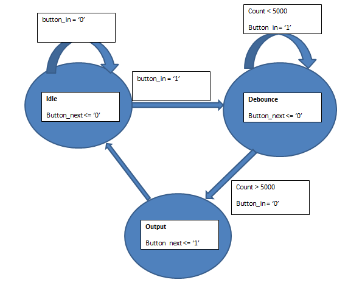

Lab2_Pong
=========

Introduction
============

The purpose of this lab was first to display "AF" on the screen using the drivers we created in Lab 1. The next goal was to create a "paddle" that could be moved up and down using two push buttons on the FPGA. Lastly, a moving ball was created that would correctly bounce off of the top, right, and bottom walls as well as the paddle. If it came in contact with the left wall, it was to stop. This would signify the end of the game. After this occurred the player could press the reset button to initiate another game.

Implementation
==============

This lab used the code written in lab 1 to drive the monitor. If you have any questions on how the monitor was driven, refer to the ECE383_Lab1 readme.

The first thing that was created in this lab was a stationary, blue AF printed on the black monitor screen. This was accomplished by writing out code for each block of the A and the F. For example, a block of code creating the left vertical piece of the A was seperate from the block of code creating the right vertical piece. I later combined these pieces where I was able to. After this was complete the ball drawing was placed first in the procedure, so that the letter drawings would take precedence over it. The paddle drawing was placed at the end, as there was no need to ever overwrite it.

The next portion of the project was the player controlled paddle. The first step to getting the paddle to work was to allow the program to recognize the top and bottom button inputs via some changes to the UCF file. Next, a pong_control entity was created. After working on this entity for a while, it became apparent through speaking with Captain Branchflower that the project would be much easier if I also created seperate entities for handling button presses. The button pressed entity took in either an up or down signal from the corresponding button, debounced that signal, and then produced a high output after this was accomplished. I instantiated two of these components, one for the up button and one for the down button, to aid in the movement of the paddle generated by the pong control entity. The pong control entity used the outputs of the two button pressed components to check what button had been pressed. If the up button was pressed, the paddle was moved -5 pixels. If the down button was pressed, th paddle was moved +5 pixels. This was also limited by a check to see if the paddle was about to exceed the limits of the screen.

The final portion of the project was the ball logic. The ball logic was placed inside of the pong control entity, and used a state machine to define its motion. The states included movement, right wall, left wall, bottom wall, paddle bounce upper, and paddle bounce lower. The right wall state would change the ball's x movement speed so that it would move to the left, the bottom wall would change the y movement speed along with the top wall. The left wall stopped the ball in order to end the game. The paddle bounce upper state would bounce the ball to the right and upwards if it contacted the upper half of the paddle. The paddle bounce lower state would bounce the ball to the right and downwards if it contacted the lower half of the paddle.

Below is a drawing of the state machine used in the button pressed entity.

Test/Debug
==========

Conclusion
==========
